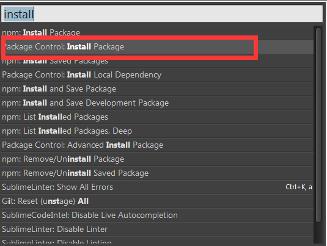
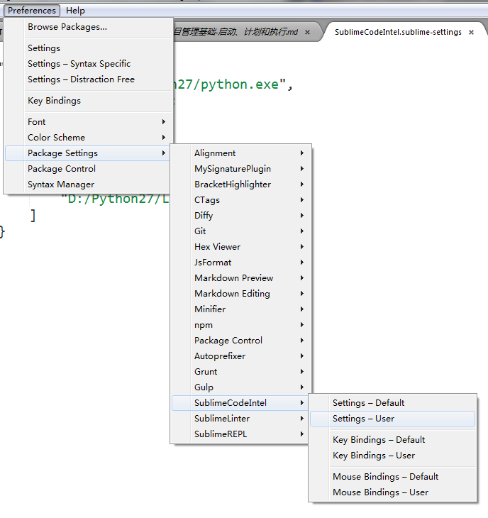
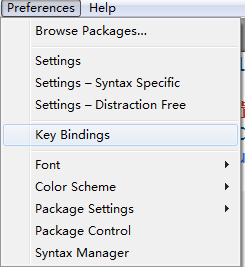

# 安装工具 #

## 安装python2.7 ##
[python2.7 Download](https://www.python.org/downloads/release/python-2712/)

## 安装wxPython ##
[wxPython Download](https://www.wxpython.org/download.php#msw)

## 安装SublimeText插件 ##
### 使用Package Control安装插件 ###
1. 按下Ctrl+Shift+P，调出命令面板
2. 输入install调出Install Package选项回车，如图：  

3. 分别输入SublimeCodeIntel和SublimeREPL，安装对应插件

### 修改SublimeCodeIntel配置 ###
1. 点击Preferences->SublimeCodeIntel->Settings - User，如下图：

2. 输入以下内容：
```JSON
{
    "Python": {
        "python":"C:/Python27/python.exe",
        "pythonExtraPaths":
        [
            "C:/Python27",
            "C:/Python27/DLLs",
            "C:/Python27/Lib",
            "C:/Python27/Lib/lib-tk",
            "C:/Python27/Lib/site-packages"
        ]
    }   
}
```

### 配置SublimeREPL快捷键 ###
1. 点击Preferences->Key Bindings->Settings - User，如下图：

2. 在文件Default (Windows).sublime-keymap中加入以下配置，f5为快捷键，根据个人喜好定制
```JSON
{ "keys": ["f5"],
  "caption": "SublimeREPL: Python", 
  "command": "run_existing_window_command", "args": 
  {
    "id": "repl_python_run",
    "file":"config/Python/Main.sublime-menu"
  } 
}
```

### Build System 配置 ###
该配置请参考以下链接  
[使用SublimeText 作为Python 的开发环境](http://jingyan.baidu.com/article/3065b3b684fdaebecff8a412.html)

### 编写好自己的代码，按快捷键编译并运行代码    ###

