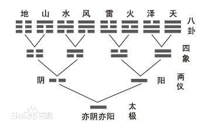
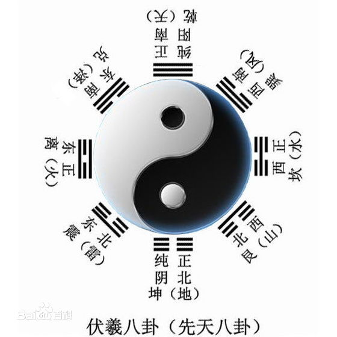

# 《中国智慧》——易中天

上周读完易中天老师的《中国智慧》，一直有事推迟到现在才开始总结。本书分为6个部分，简要概述了中国哲学进步史。
就如易中天老师在后记中写道，对于我这种只是想到“观其大略”的读者还是很合适的。
> 智慧与知识不同。知识属于社会，智慧属于个人；知识可以授受，智慧只能启迪 ————易中天

## 周易的启示
周易由《易经》和《易传》两部分组成，易：简易、变易、不易；经：经典、永恒的道理；传：传记、注释解读。
这章让我较为详细的了解了两仪、四象、八卦。
 

### 两仪
--：阴爻，——：阳爻，一阴一阳谓之道，万事万物都包含阴阳，阴中有阳，阳中有阴，阳极生阴，阴极生阳。
奇数为阳，偶数为阴；山南水北为阳，山北水南为阴；有阴有阳代表的事物的两面性。

### 四象
太阳->少阴->少阳->太阴；上图中四象列从右往左的顺序，区分四象时，从下往上看，以下为主。

### 八卦
 
>八卦歌诀：
>乾三连 坤六断
>离中虚 坎中满
>震仰盂 艮覆碗
>兑上缺 巽下断

### 方法
《周易》的方法有三条，抓住根本、掌握规律、建立系统。

### 启示
《周易》的启示有四条：  
1. 忧患意识
2. 理性态度
3. 变革精神
4. 中庸原则（因为从各种信息中，《周易》都反馈除了恰到好处，卦象中也是以执中为最佳）

## 中庸的原则
现在很多人其实觉得中庸不好，对中庸有一定的误解，本章中开始由中庸不是什么开始讲起，相当于为中庸正名。
### 中庸不是什么
1. 不是老好人  
《论语•阳货》乡原，德之贼也。乡原：老好人，贼：人身伤害，盗：财产损失，寇：外敌入侵，匪：犯上作乱。
2. 不是和稀泥  
《论语•为政》知之为知之不知为不知，是知也。说明要实事求是，不是提倡和稀泥的。
3. 不是没有原则  
中庸的原则就是中庸，中庸本身就是最高原则。

### 什么是“中”
中就是不偏不倚、不走极端、不唱高调。

### 什么是“庸”
庸，常用的，平常的。

### 什么是“中庸”
中庸就是无过无不及，恰到好处的平常就常用的道。中庸是常人之道、适中之道、可行之道。
经：不变的，权：变化的。有经有权才是中庸。把握自己的底限，守住底限比追求高尚更可贵。
中庸是一种道德境界、一种思想方法、一种处世哲学、也是一门做人的艺术。

## 兵家的思考
兵家，理性是灵魂，通过利益的方式来思考解决方案，趋利避害。
孙子是战争经济学家。

## 老子的方法
老子讲的是做人，老子讲的是人道，做人之道。老子也许是世界上最早的人道主义者。
老子的价值取向是求下、贵柔、崇阴、尚无、喜欢原生态。
《老子》是不变的哲学，是否定的哲学，老子的思想就是一枚硬币，真无为和假无为是它的两面。
事物都存在两面性，矛盾对立的两方是相反相成的，是会相互转化的。

## 魏晋的风度
魏晋的风度是怪异的风度，这种怪异体现了一种价值观：真性情、高智商、美仪容。
魏晋的风度还要包括风采和雅量。风采和仪容有关，雅量与性情有关。真性情而有雅量，美仪容而有风采，则是因为智慧。大智若愚，表现出来的就是雅量。智者乐水，表现出来的就是风采。
魏晋的价值取向可以说是以下几条：向往自由、渴望真情、蔑视世俗、服从内心、热爱自然。
它是一个转折点，一个里程碑，完成了一下的转折：从有用到没用、从人格到人情、从社会到自然。

## 禅宗的智慧
> 所谓“禅宗”，就是印度佛教传入中国以后，吸纳了儒道两家的思想，经过魏晋玄学和魏晋风度的洗礼，产生出来的又一种智慧。它标志着中国智慧已经从早熟走向了成熟，从思想变成了境界。————易中天

禅宗抓住了佛教的根本——觉悟，将佛学从天国拉入人间，简易化，本土化，自我化。
事实上，禅宗否定的是执着，肯定的是自由；否定的是教条，肯定的是自我。