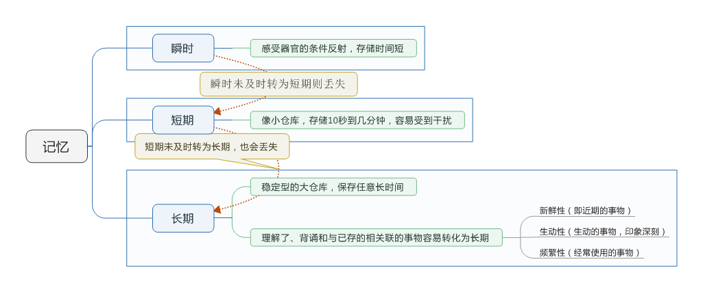
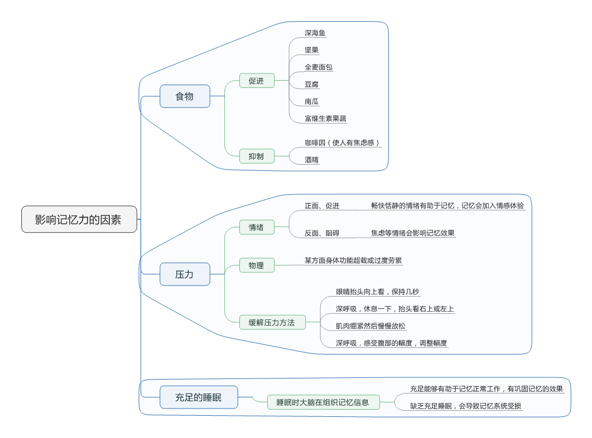

# 总述

今天，学习提高记忆力的相关课程，将笔记整理总结

# 理解记忆

> 记忆力是一种记忆事物的功能，是一个存储库。

## 如何记忆

## 影响记忆力的因素

# 增强记忆
## 记忆力开发
> 记忆力不是一成不变的，有效的管理和培养记忆是可以有助于提高记忆力的。课程中介绍了四种方法：

> 1. 培养记忆的信心  
> 2. 明确记忆的意图  
> 3. 有选择的遗忘  
> 4. 兴趣培养  

### 培养信心
> 要对自己的记忆能力有信心，否则会抑制脑细胞活动，导致记忆迟钝。但是光有自信没有努力也是不行的。对于如何培养信心，需要不畏难，不能因为觉得困难就不做了；从大处着眼，从小处着行，从实际出发，从记忆小部分材料开始记忆，发现有畏惧心理时，可以回忆以往的成功经验，让自我有部分满足感，继续记忆

### 明确记忆意图
> 明确自己记忆内容的意图，让自己产生至关重要的感觉，然后就会有强烈的意图去记忆，提高记忆效果

### 有选择的遗忘
> 不要以为遗忘是记忆的敌人，有选择的遗忘会帮助记忆的。我们应该把记忆用在刀刃上，经常吐故纳新，这样有助于巩固有用的知识。

### 兴趣培养
> 人们对于自己感兴趣的事物，总是会比较容易记住、记牢，反之则容易忘记；对于感兴趣的事物，会使人产生兴奋点，会排除干扰，专心致志的记忆，记得快而且牢固；我们在记忆时应该把事物当做自己的兴趣，把材料当做‘儿戏’，进行有趣的联想，臆造，让自己记忆深刻。

## 提升记忆力的方法
### 连锁记忆法
> 利用新奇的形象的思想方法把事物串起来，使其环环相扣，把无关的事物串联，不但使记忆快速，而且大脑负担会更轻松

### 联系记忆法
> 把想要记住的和已经记住的联系起来，增强记忆效果。

---
> 可以使用以下几种方法：  

> 1. 有意识的建立联系，把不熟悉的和熟悉的联系起来  
> 2. 使用记忆联系圈，围绕一个事件点，展开思考，由点及面
> 3. 把信息串联起来记，以逻辑为基础
> 4. 利用夸张幽默的方法来帮助自己记忆，使用第一印象来记忆，总是记忆最深刻的。

### 地点记忆法
> 使用熟悉的地点加上清晰的方位物，把需要记忆的信息对应到方位物中。

# 记忆力的一些应用
## 听得方法
> 沟通包括读写听说，听的比例占很大比例，听是最常用的沟通方式。

### 如何听
> 1. 寻找关键词，用心听，找出中心点和关键内容。
> 2. 提问，听完后将自己的疑问提出来，有助于提高理解，并确认信息的正确性。
> 3. 用自己的语言重复要点，检查是否理解。
> 4. 不要根据第一印象就下结论，学会耐心听。

### 听的好习惯
> 1. 不要随意打断别人，这样不礼貌，而且在思考说话内容时会影响到记忆当前听到的内容。
> 2. 数到3，在提问等过程中提供间歇期，停顿有助于自我理解，讲话者也能做到总结，补充。
> 3. 与讲话者同步，不匆忙下结论或者预测后面的内容，帮助记忆容纳听到的信息。
> 4. 集中注意力，用心倾听。

## 牢记演讲词 ##
### 使用的方法 ###
1. 使用事物本身的特征以及感情表达方式提高记忆
> a. 用眼阅读  
> b. 用口舌响读  
> c. 动心思情读  

2. 抓住逻辑构成，掌握思想轨迹，这样就抓住了记忆要领

> 思想轨迹分为两种
> 1. 基本：提出问题-分析问题-解决问题  
> 2. 变化分为三种  
>    a. 简化式:序论-本论-结论,分别对应基本的三个点  
>    b. 互置式:先亮观点,然后进行分析解决,使用首尾互置的方法  
>    c. 散论式:用于即兴演讲,适合短时间的演讲,抓住主线即可

## 克服健忘的方法 ##

### 查看日程表 ###
> 日程表不仅要写,还得看,每周的周计划在周一的时候进行了解分析。

### TODOList ###
> 记录重要的马上要做的事情，并根据类别分类，放在一个醒目的地方，并根据事情的重要紧急程度分开放置，可以使用便签纸。

### 醒目的标记 ###
> 给重要的信息做醒目的标记

### 旅行备忘录 ###
> 出门旅行时，可以记录个人用品、文件、资料，在出门和出酒店时能够检查是否遗漏。

### 固定的摆放位置 ###
> 对于物品使用，从哪里拿放回哪里去，不会导致想用时发现找不到了。

### 巧用记录本 ###
> 1. 选择一本自己喜欢的记录本。
> 2. 记录本可以记录电子邮件信息和一些重要信息，还可以记录时间点。
> 不仅对与他人相关的事物认真负责，对于自己的事情也要保持一样的态度。 

 ***记录本也可以使用手机软件等，可以起到优化信息整理，简化信息，并抓住重点的作用***