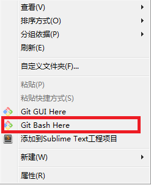
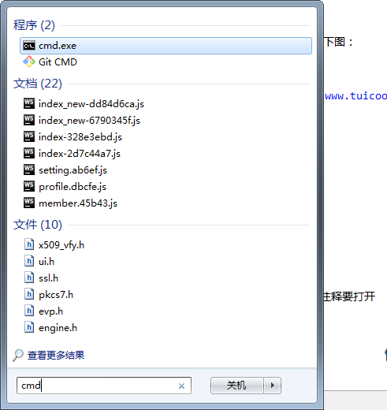
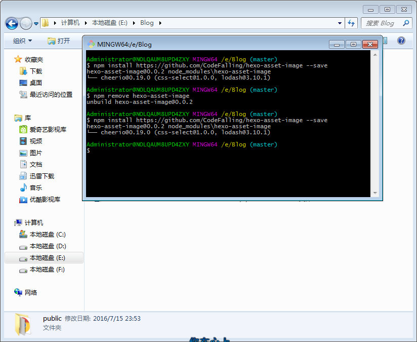
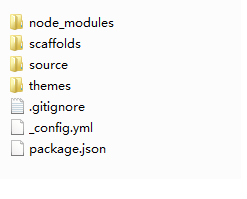

# 简述

近期开始写博客,搜索之后使用hexo和github进行搭建自己的博客,期间出现了问题,仅以做为记录

# 运行环境
[史上最详细“截图”搭建Hexo博客并部署到Github-angelen10](http://jingyan.baidu.com/article/d8072ac47aca0fec95cefd2d.html)  
[HEXO+Github,搭建属于自己的博客-潘柏信](http://www.jianshu.com/p/465830080ea9)
[创建GitHub技术博客全攻略-铁锚的CSDN博客](http://blog.csdn.net/renfufei/article/details/37725057/)
## 安装Node
到[Node官网](https://nodejs.org)下载相应平台的最新版进行安装
## 安装Git
安装Git是为了将hexo的内容提交到github上,到[git下载网页](https://git-scm.com/download)下载相应平台的安装
## 申请Github账号
到[github官网](https://github.com/)注册,并选择Free免费账号完成设置
## 创建Repository(页面仓库)
到[仓库创建页面](https://github.com/new)创建与自己账号对应的账号分支,如damonxiong.github.io。  
创建仓库按如下图显示设置

# hexo
[hexo官网](https://hexo.io/)  
[NexT文档](http://theme-next.iissnan.com/)  
[hexo博客更换主题-小道博客](http://www.tuicool.com/articles/zeIZJzv)

## hexo安装
### 安装
安装完成后,鼠标右键使用Git Bash Here 
 
或者直接打开cmd命令行操作
 
输入命令：
<pre><code>npm install -g hexo</code></pre>  

> 注意：npm命令中-g代表全局安装  

### 创建自己的hexo目录并初始化
到自己喜欢的路径下创建文件夹，并进入到相应文件夹中，如下图：
  
输入命令:
<pre><code>hexo init</code></pre>

生成如下目录结构如下图:

### 安装依赖库
调用以下命令安装依赖库
<pre><code>npm install</code></pre>

### 本地查看页面
## hexo配置
### 资源文件夹使用
[在hexo中无痛使用本地图片-M-x codefalling](http://www.tuicool.com/articles/umEBVfI)

### 标签(Tags)和分类(categories)

#### 添加方式
新建的marddown文件开始title区段中添加
<pre><code>categories: xxx
tags: 
  - tag1
  - tag2
</code></pre>

**注意点：**
1. 冒号后面要有空格
2. 要添加tags和categories页面
3. 主题的配置文件和站点的配置文件tags和categories的注释要打开

#### 添加标签
确认站点配置文件里有tag_dir: tags  
确认主题配置文件里有tags: /tags 
输入命令：
<pre><code>hexo new page tags</code></pre>
编辑站点的source/tags/index.md，添加
<pre><code>
---
title: tags
date: 2015-10-20 06:49:50
type: "tags"
comments: false
---
</code></pre>

#### 添加分类
确认站点配置文件里有category_dir: categories  
确认主题配置文件里有categories: /categories
输入命令：
<pre><code>hexo new page categories</code></pre>
编辑站点的source/tags/index.md，添加
<pre><code>
---
title: categories
date: 2015-10-20 06:49:50
type: "categories"
comments: false
---
</code></pre>

## hexo主题相关
在[官网主题](https://hexo.io/themes/)中有一些主题,我个人使用的是NexT主题
### NexT主题
[NexT主题主页](http://theme-next.iissnan.com/)
#### 主题安装
#### 主题配置