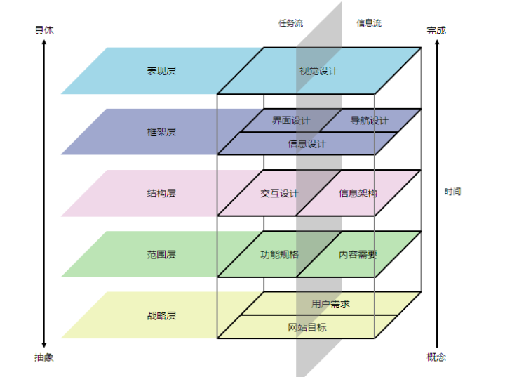

# 网络学习链接汇总
1. [前端，如何提升用户体验](https://juejin.cn/post/6844903920037265415)
2. [10分钟读完《用户体验要素》](https://zhuanlan.zhihu.com/p/24479304)
3. [关于用户体验，有什么好的书籍推荐](https://www.zhihu.com/question/19674221)

# 笔记
## 10分钟读完《用户体验要素》
1. 用户体验设计通常要解决的是应用环境的综合问题。
   1. 视觉设计选择合适的元素，能引起用户的注意；
   2. 功能设计要保证这个元素，能触发适当的动作。
2. 为体验而设计：使用第一
3. 用户体验就是商机，任何在用户体验上所做的努力，目的都是为了提高效率，两种形式表现：
   1. 帮助人们工作得更快
   2. 减少他们犯错的几率
4. 以用户为中心的设计
5. 

## 前端，如何提升用户体验
1. 用户体验的四要素
   1. 产品的使用属性第一。一个产品如何设计最终的使用功能不会变；
   2. ‘没有’用户去读使用说明书。在我接触的很多用户中，大部分不会去查使用说明书，遇到问题都是直接问；
   3. 竞争激烈的，一旦你失去一个用户，就很难再接触到此用户。事实告诉我们一旦使用一个东西感觉不好，绝对不想去接触它第二次；
   4. 好的用户体验不一定成就一个产品，但是坏的用户体验绝对可以毁掉一个产品。一定要注重用户体验，不然只能面临失败；