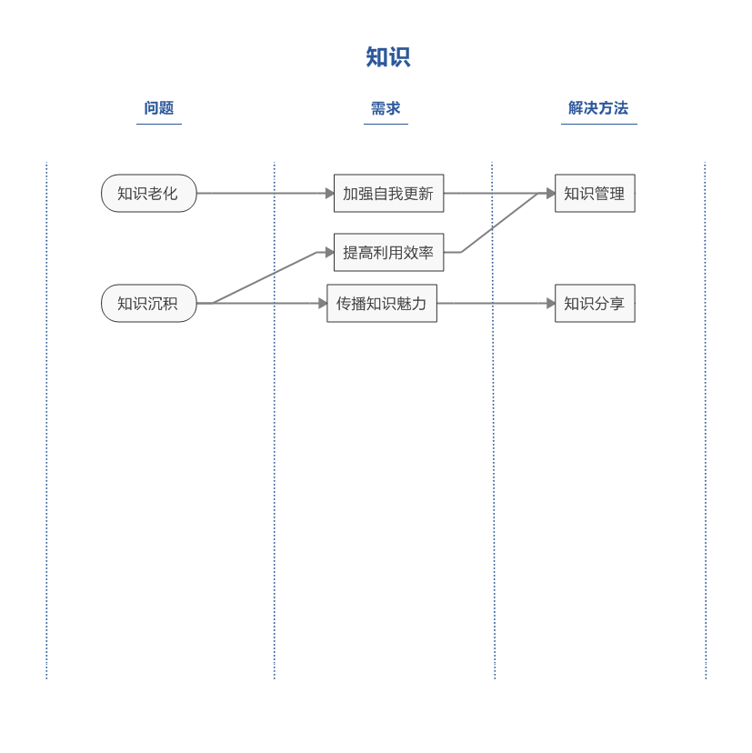

# 知识定义

知识分为外部知识和内部知识，也可分为显性知识和隐性知识。随着知识的日新月异和大量积淀，无论企业还是个人，都面临知识老化和沉积这两个问题。

# 知识管理
在当今这信息大爆炸的时代,无论对于企业还是个人, 随着知识的日新月异和大量爆发,都需要面临两个问题

## 知识老化
> 社会加速发展,科技层出不穷,个人的知识体系往往不能与时俱进,很多人都受此困扰.流水不腐,如果知识不能具备自我更新的能力,需要提高警惕了.

## 知识沉积

> 企业和个人在发展中都会学习和产生大量的知识,但沉积的知识是无法发挥其价值或者是最大价值,无法与他人交流分享.特别是企业,如果忽视知识管理,不但会增加相应的沟通成本,还会限制企业的软实力提升.

> 提高知识利用率,特别是隐性知识,是软实力的体现,增加科教系统的软实力,对于增强国家竞争力有深远影响

> 备注:软实力,整合和使用硬实力的能力,是企业发展不可或缺的支撑要素.主要分为人和事,人分为管理者和决策者,事分为有形和无形.硬实力,以物化形式存在的要素,是衡量企业实力的客观标准.

# 知识分享

> 夫子云：独学而无友，则孤陋而寡闻。三人行，必有我师焉。充分说明了互相学习的必要性。
> 通过工具\机制\社区等方式我们可以达到知识分享的目的.

