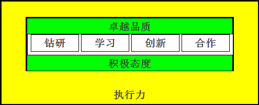
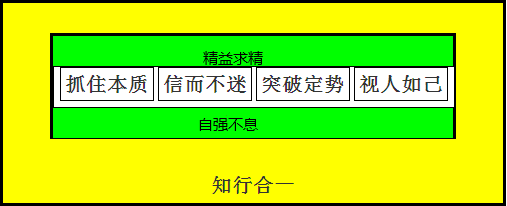

# 专家成长的七要素
## 积极态度   
	为自己而工作
## 卓越品质  
	像艺术一样打磨自己的交付件
### 钻研  
	抓住本质
## 学习  
	消化吸收+辩证取舍=信而不迷
## 创新  
	抓住矛盾本质+掌握创新规律+突破思维定势
## 合作  
	帮助别人就等于帮助自己
## 执行力 
	认识->知道->理解->认可->实践->习惯
# 基础图

# 内涵图

七、心态图

八、关系图

		
					
		
	

