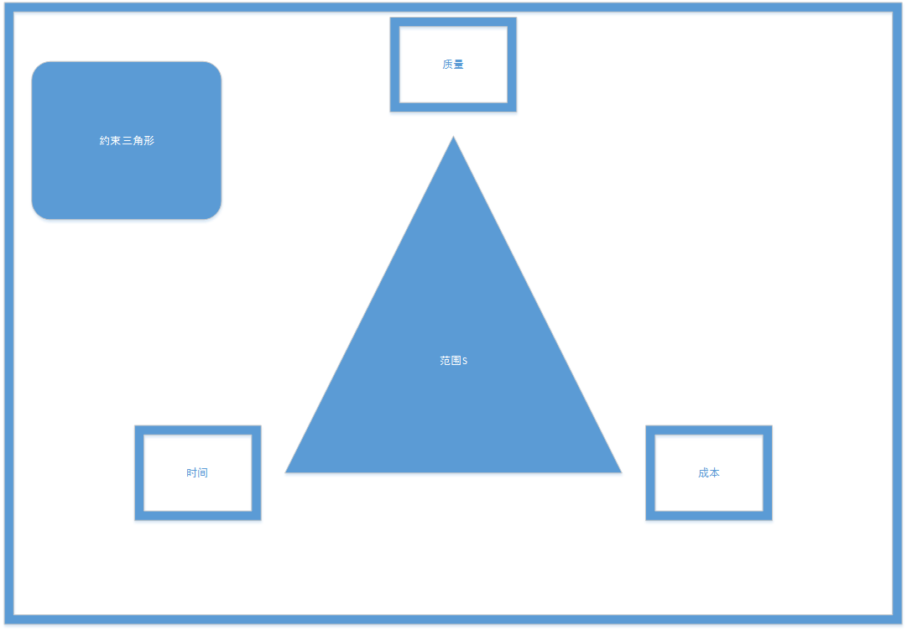
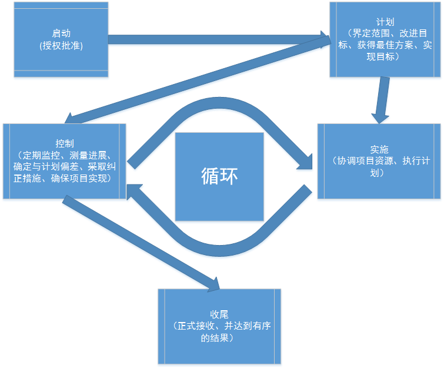
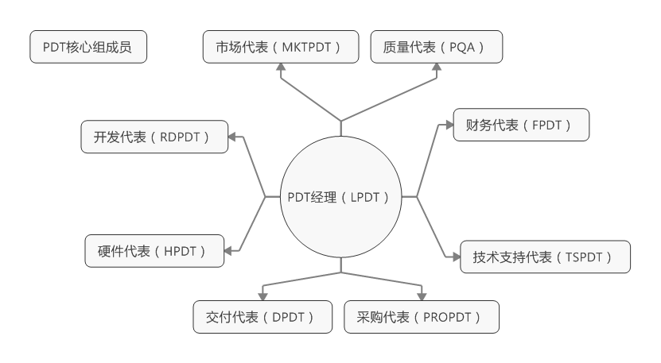
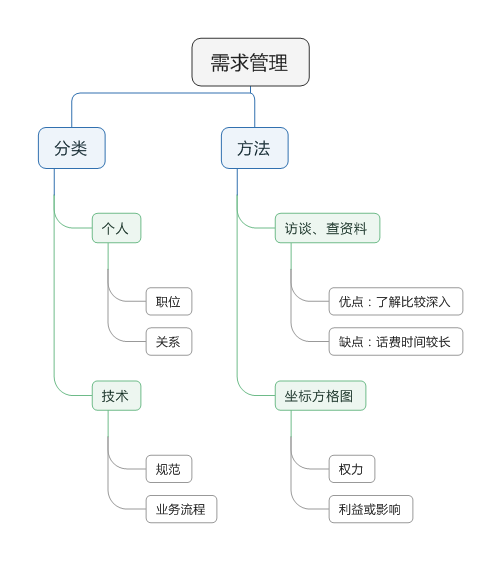
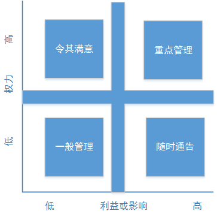
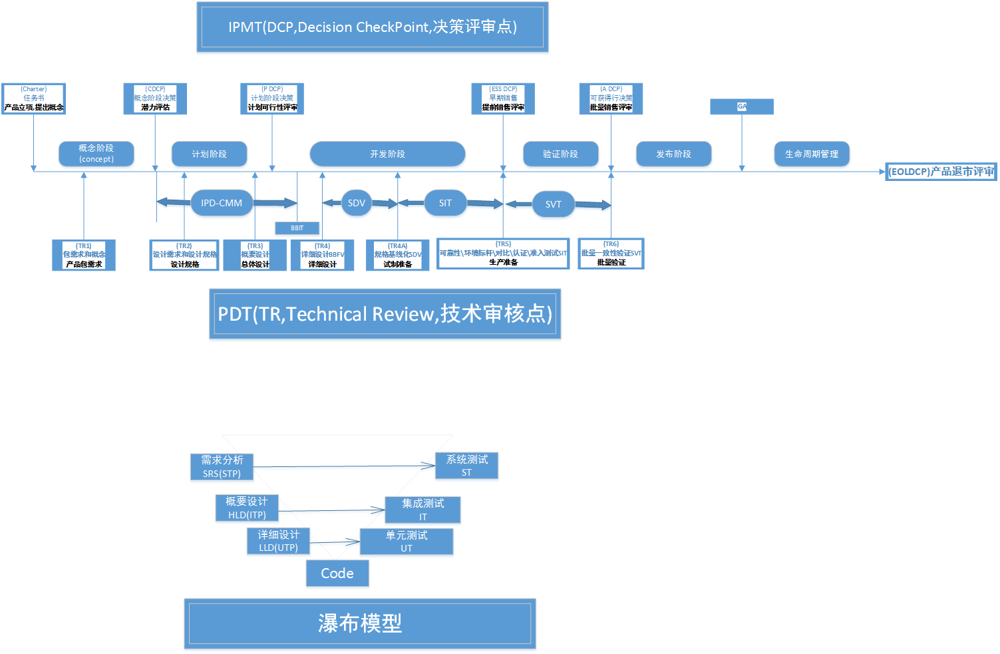
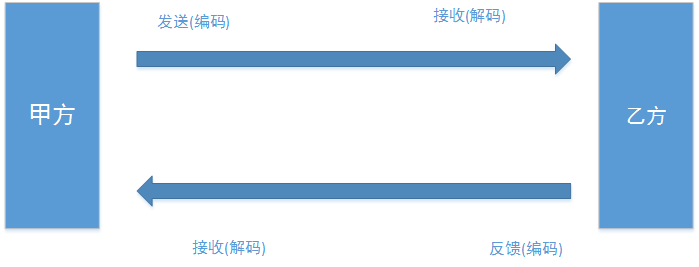
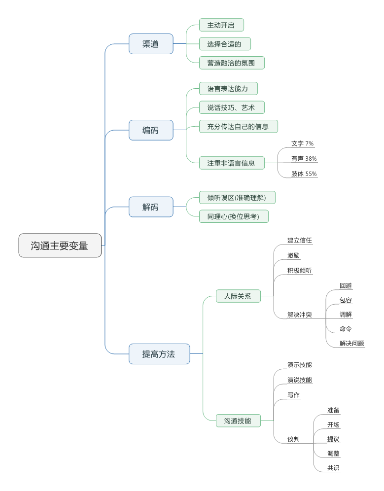
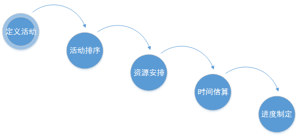
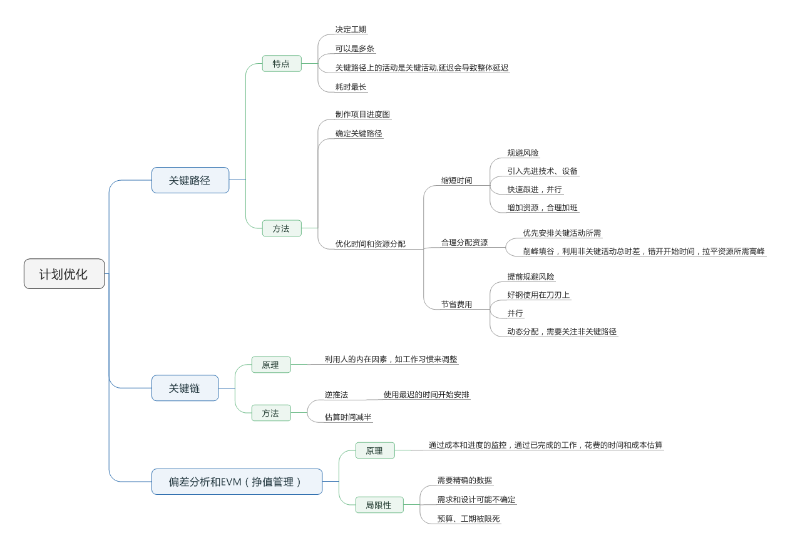

# 项目 #

## 项目定义 ##
1. 项目是创造唯一的产品或服务的时限性工作，在规定的时间、费用、性能参数下，由组织或者个人完成特性目标的独特活动。  

2. 项目失败最多的原因是管理出现问题，需要通过理念、流程、方法和工具等来实现管理。  
3. 项目是临时行的并且独特的，那些重复性的运作属于运营，不属于项目。  

## 项目管理 ##

1. 项目管理是个过程,使用知识、技能、工具和技术，并把这些应用到项目中，满足或超过项目干系人的要求。  
2. 项目管理特征：目的性、时限性、唯一性、有合作。  
3. 正确的做事是项目管理的特点
4. 项目管理过程是重叠的
5. 结构化的流程为团队实施项目提供指南
> 1. 整合参与者的愿求
> 2. 提供统一的通用属于,避免混淆
> 3. 标准规范,保证质量
> 4. 确保没有忽略关键任务,使计划更可靠  

6. 产品开发是在结构化和非结构化之间找到平衡

## 项目干系人 ##
1. 干系人是与项目相关，对项目有各种影响力的人
2. 包括但不局限于项目经理、项目团队成员、客户、执行组织、发起人和其他
3. 干系人是否满意是确定项目是否成功的标识，是项目的基石
4. 干系人需要分清主次，满足主要干系人需求
5. 确认项目干系人的好处：获取更多的资源、理解和支持
6. 确认项目干系人的方法：检查清单，专家访谈

### PDT(Product Development Team,产品开发团队) ###

## 需求管理 ##

[坐标方格图]

1. 项目管理失败原因中，需求分析不正确占比64%
2. 对于需求的管理，需求变更控制，要学会Say No，阻止随意变化，前期多投入，后期多控制
3. 形成产品说明书，包含产品概述、产品特性、功能需求、非功能需求、什么是不需要的
4.如果必须变更,变更过程需要注意:  
	a. 沟通干系人  
	b. 严格监控并及时协调,解决问题  
	c. 注意关键路径  
	d. 严格执行变更流程  

## IPD(Integrated Product Development,集成产品开发) ##
### IPD 核心思想 ###
> 强调以市场需求作为产品开发的驱动力,将产品开发作为一项投资来管理
### IPD流程图 ###

## 项目启动 ##
### 设立项目目标 ###
1. 可根据SMART原则设立目标
> SMART原则(制定有效的项目目标)  
> S (Specific) 明确性 最终目标是否明确了程度和时间  
> M (Measurable) 可度量性 能在多大程序上测量最终目标的完成情况  
> A (Achievable) 可完成性 在规定的时间内,最终目标十分合理,能否实现
> R (Relevant) 相关性 最终目标是否很重要,很有价值,十分继续进行
> T (Time-Bound or Time-Based) 可跟踪性或时限性 能否对项目的时间进程进行跟踪检查 

2. 大型目标和小型目标
> 小型目标,根据合同和管理层的需求,进行翻译,设定完成目标
> 大型目标,编写章程,包含干系人、合法性、战略相关信息、总体目标等

3. 项目章程
> 了解项目做什么
4. 项目范围
> 怎么做，做到什么程度
5. 关键步骤
> 设置里程碑,确定阶段性的成果,并且成果需要独特且可验证
6. 假设
> 假设未来的风险,确定相关的备用方案
7. 制约因素
> 预算、资源、质量、产品功能等

## 项目计划 ##
### WBS(Work Breakdown Structure,工作结构分解) ###
1. 作用
> 形成计划,绘制甘特图,创造进度网络图,风险分析
2. 方法:基于产品或服务/基于产品或服务的过程/模板法
3. 工具
> 1. 头脑风暴,畅谈:a.核心成员参与,b.100%完成项目没有遗漏,c.工作量以一至二周为佳,d.文档化可考核,e.清晰的责任人
> 2.检查清单:a.每个任务状态完成可量化,b.明确任务的开始结束,c.有交付结果,d.易于估算且可接受期限内,f.容易估算成本,g.任务独立

4. 资源安排
> 使用活动清单和里程碑,考虑公司的资源日历(人员是否有时间,公司统一假期等),进行资源安排  
> 资源包括人力、材料、设备和用品等  
> 可以通过专家判断或者项目管理软件(OpenProg/Microsoft Project/Gantter/Primavera)  

5. 项目启动阶段
> 1. 根据活动制作相应网络图
> (1) 估算各活动的时间:  
> a.专家判断  
> b.类比估算  
> c.计算估算,分为参数估算和三点估算  
> (2) 通过依赖关系对活动进行排序  
> 2. 成本估算  
> 3. 沟通计划
> 4. 质量保障计划
> 5. 风险计划

## 沟通计划 ##
### 定义 ###
> 在适当的时间把适当的信息通过适当的渠道传达到适当的项目干系人,确保干系人理解和支持  
> 应当根据每一个干系人制定对应的沟通计划,沟通需要及时,信息量要恰到好处  

### 沟通计划表格 ###
> 表格可以包含以下列表:名字/目的/所需信息/沟通方法/频率/信息整理人/备注

### 方式 ###
1. 交互式
> 达成共识,交换信息
2. 动式
> 信息准确,如邮件信件等
3. 拉式
> 信息量较大,如网络信息等

### 沟通模型 ###

1. 沟通最主要变量:编码、解码和沟通渠道

## 进度控制 ##
### 计划制定流程 ###

### 计划优化 ###

